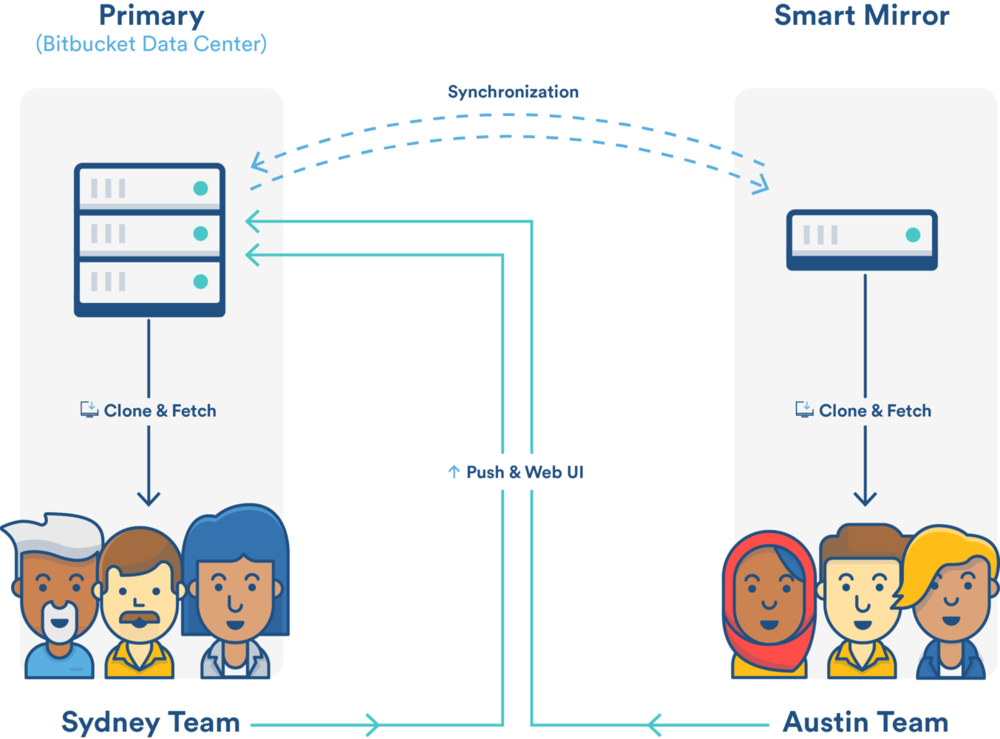
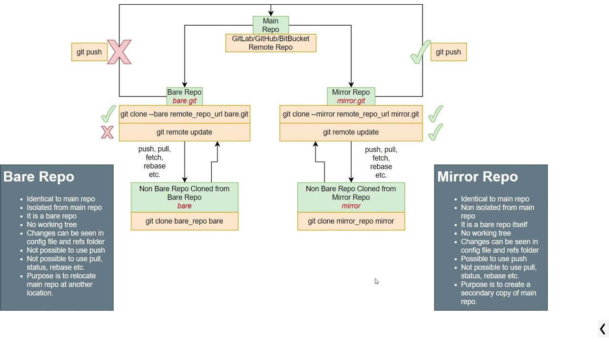

### git-mirror-concept
 Unlock the power of Git mirroring! This guide explores advantages, setup steps, and best practices. Enhance backups, boost collaboration, and integrate with CI/CD workflows seamlessly. Your go-to resource for efficient repository mirroring.

# Git Repository Mirroring
Overview
Git repository mirroring involves creating a duplicate copy of a Git repository, providing various benefits such as backup, redundancy, and improved collaboration. This README.md guide outlines the advantages of mirroring and provides step-by-step instructions on setting up a mirrored repository.

Table of Contents:

- Advantages of Mirroring
- Setting Up a Mirrored Repository
- Considerations and Best Practices



## Advantages of Mirroring
1. Backup and Redundancy:

Mirroring serves as a reliable backup mechanism. In case the primary repository is compromised or accidentally deleted, the mirrored copy ensures data recovery and project continuity.

2. Geographic Distribution:

By having mirrored repositories in different geographical locations, you can enhance performance and reduce latency for users accessing the repository from various regions. This is particularly useful for globally distributed teams.

3. Collaboration Across Platforms:

Mirroring facilitates collaboration across different Git hosting platforms. It allows teams to work seamlessly, even if they prefer different platforms, fostering cross-platform compatibility.

4. Continuous Integration/Continuous Deployment (CI/CD):

Mirrored repositories can be integrated into CI/CD pipelines, enabling automated testing and deployment processes. This reduces the load on the primary repository and enhances overall performance.

### Setting Up a Mirrored Repository
Follow these steps to set up a mirrored repository:

Step 1: Clone the Primary Repository
Clone the primary repository using the following command:

```bash
git clone --mirror <primary-repo-url>
```

Step 2: Add the Mirrored Repository as a Remote
Navigate to the cloned repository and add the mirrored repository as a remote:

```bash
cd <cloned-repo-directory>
git remote add --mirror=push mirrored <mirrored-repo-url>
```

Step 3: Push to the Mirrored Repository
Push changes from the primary repository to the mirrored repository:

```bash
git push --mirror mirrored
```

Now, your mirrored repository is up-to-date with the primary repository.

## Considerations and Best Practices
- Regular Synchronization: 

Schedule automated synchronization processes to prevent the mirrored repository from falling out of sync with the primary repository.

- Security Measures: 

Ensure consistent security practices across both repositories, especially if hosted on different platforms.

- Storage and Bandwidth: 

Be mindful of storage and bandwidth costs, particularly for large repositories with frequent updates.




#### __*To setup mirror between gitlab and github*__

[Click here to get the steps for creating mirror between gitlab and github](docs/setup/gitlab_github_mirror.md)


## Pros and Cons:

### Advantages:
- Backup and Redundancy
- Geographic Distribution
- Collaboration Across Platforms
- Continuous Integration/Continuous Deployment (CI/CD)

### Disadvantages:
- Complexity and Maintenance
- Potential for Out-of-Sync Issues
- Storage and Bandwidth Costs
- Security Considerations


## Conclusion
Git repository mirroring is a powerful technique offering several advantages, from backup and redundancy to improved collaboration. By following the steps outlined in this guide and considering best practices, you can set up an effective mirrored repository to enhance your development workflow.


## License

This project is licensed under the [Apache License 2.0](https://www.apache.org/licenses/LICENSE-2.0) - see the LICENSE file for details.

Please replace `https://github.com/devopshubproject/git-mirror-concept` with the URL of your Git repository if you have one. This README provides a comprehensive guide to your Git Mirroring concept and can be extended or modified as needed.


## <font color = "red"> Follow-Me </font>

[](https://github.com/premkumar-palanichamy)

<p align="left">
<a href="https://linkedin.com/in/premkumarpalanichamy" target="blank"></a>
</p>

[](https://www.youtube.com/channel/UCJKEn6HeAxRNirDMBwFfi3w)


